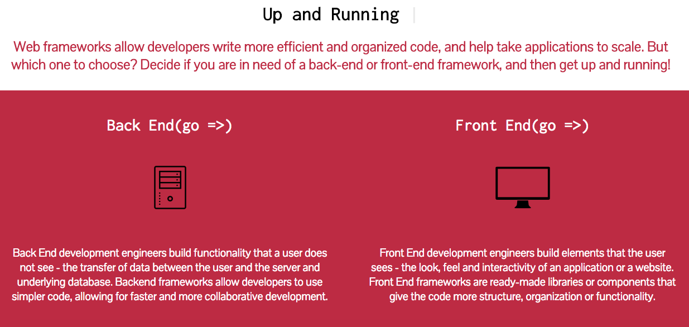

# 

## Technologies Used:
This application uses MongoDB, Express JS, NodeJS and AngularJS

## Installation

1. Clone the repo locally.
2. install the dependencies with `npm install`.
3. Run on the command line with `npm start`
4. Start the NodeJS server by typing node index.js into your terminal.
5. Go to http://localhost:4000/#/ends to view your application locally.
